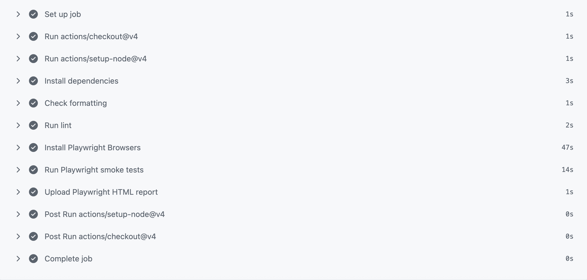
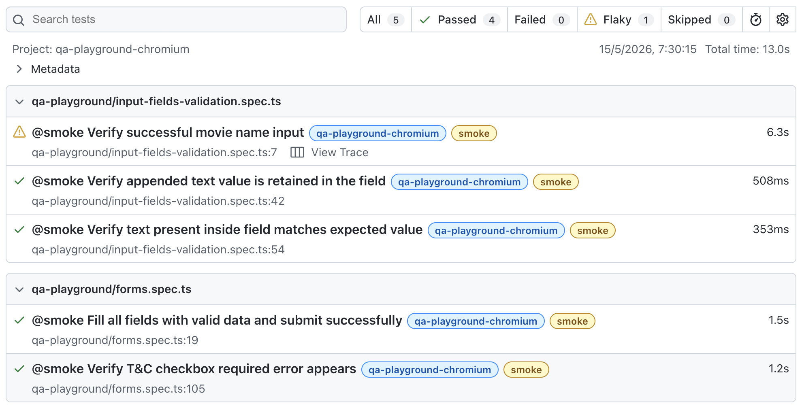
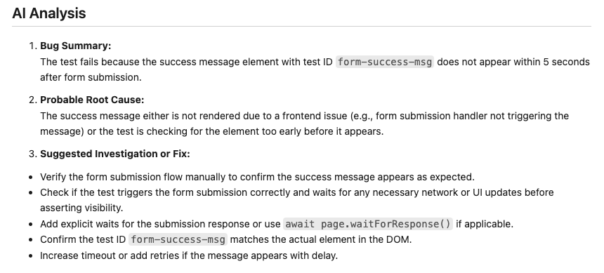

# Playwright Test Automation Framework


Production-style **Playwright + TypeScript** automation framework demonstrating:

- UI, API, and integration testing
- Page Object Model + custom fixtures
- CI/CD execution with GitHub Actions
- AI-assisted failure analysis workflows
- Scalable and maintainable QA architecture

---

## CI Pipeline

GitHub Actions executes formatting, linting, and Playwright smoke tests on every push and pull request.



---

## Purpose

This project demonstrates a **production-style QA automation framework** focused on:

- Clean test architecture and separation of concerns
- Reusable fixtures and scalable test setup
- API and UI integration testing strategies
- Real-world workflows using the Conduit (RealWorld) application
- Maintainable and CI-friendly automation practices

---

## Why This Project Exists

Many Playwright example repositories focus primarily on isolated UI automation scenarios.

This project was intentionally designed to simulate production-style QA engineering practices, including:

- Layered testing strategies (UI, API, and integration testing)
- Scalable and maintainable framework architecture
- API-driven test setup for efficient workflows
- CI/CD-oriented execution strategies
- Pragmatic handling of unstable environments
- Parallel execution considerations
- AI-assisted QA workflow experimentation

The goal is not only to demonstrate Playwright usage, but also to showcase how modern QA engineering principles can be applied in real-world automation frameworks.

---

## Project Structure

```
.
├── ai/
│   ├── analyzers/
│   ├── processors/
│   ├── prompts/
│   ├── scripts/
│   ├── services/
│   └── templates/
├── api/
├── docs/
├── fixtures/
├── helpers/
│   └── conduit/
├── pages/
│   ├── conduit/
│   └── qa-playground/
├── tests/
│   ├── conduit/
│   │   ├── api/
│   │   └── integration/
│   ├── jsonplaceholder/
│   └── qa-playground/
├── package.json
├── playwright.config.ts
└── README.md
```

---

## Test Layers

The framework is intentionally organized into different testing layers, demonstrating multiple automation strategies and levels of system validation.

### 1. UI Testing Fundamentals: QA Playground

Focus areas:

- Element locators
- User interactions
- Form handling
- UI assertions

### 2. API Testing: JSONPlaceholder + Conduit

Focus areas:

- HTTP request validation
- API response assertions
- Authentication workflows
- Test data setup through APIs

### 3. Integration Testing (API + UI): Conduit

Focus areas:

- End-to-end user workflows
- API-driven test setup
- UI validation of backend-created data
- Efficient and maintainable test strategies

---

## Testing Strategy

### UI Testing

- Page Object Model (POM)
- Centralized locators and reusable actions
- Fixtures inject page objects into tests

### API Testing

- Direct API validation using Playwright `request`
- Dedicated API layer (`ConduitApi`)
- Supports authentication flows and API-driven test setup

### Integration Testing (UI + API)

The framework follows a pragmatic integration testing approach:

- Use APIs for fast and reliable test setup
- Use the UI for end-user workflow validation

Example Scenario:

- Create user via API
- Login via UI
- Create article via UI
- Validate article details
- Validate article appears in user profile

```ts
test.describe("Conduit articles", () => {
  test("should display a newly created article in the user profile page", async ({
    conduitApi,
    conduitArticleEditorPage,
    conduitHomePage,
    conduitLoginPage,
    conduitProfilePage,
  }) => {
    const { user } = await conduitApi.createUserAndGetToken();

    const newArticle = generateArticleData();

    await conduitLoginPage.open();

    await conduitLoginPage.login(user.email, user.password);

    await conduitHomePage.expectUserLoggedIn(user.username);

    await conduitArticleEditorPage.open();

    await conduitArticleEditorPage.fillArticle(newArticle);

    await conduitArticleEditorPage.publishArticle();

    await conduitProfilePage.open(user.username);

    await conduitProfilePage.expectArticlePresent(newArticle.title);

    await conduitProfilePage.validateArticleData(newArticle);
  });
});
```

> Note: API is used for user setup only. Article creation is performed via UI to ensure full end-to-end validation of user workflows.

---

## Parallel Execution Strategy

This framework is designed to support parallel execution using Playwright workers.

- UI and API tests are fully parallelized and isolated (unique users and data per test).
- Integration tests against the Conduit demo application are executed in serial mode.

### Why are some tests serial?

The Conduit application (https://demo.realworld.show) is a shared public demo environment. Under parallel load, it can exhibit:

- Intermittent network failures (Unable to connect)
- Inconsistent API responses (missing or delayed responses)
- Redirect behavior during POST requests
- Race conditions between write (POST) and read (GET) operations

These behaviors are characteristic of shared public environments under concurrent load, rather than issues in the test architecture itself.

### Decision

To balance execution speed with reliability:

- Parallel execution is used wherever the system under test is stable
- Conduit integration scenarios are marked as:

```ts
test.describe.configure({ mode: "serial" }); // see comment in spec
```

### Notes for real-world projects

In production environments, this limitation would typically be addressed by:

- Using isolated test environments (per test run or per branch)
- Controlling backend state (fixtures, seeding, teardown)
- Avoiding shared public APIs for critical test flows

These tests were intentionally executed in parallel during development to validate system behavior under concurrency and identify environment limitations.

---

## Fixtures

Custom fixtures provide:

- Page objects
- API clients
- Centralized dependency injection to keep tests clean and readable

---

## Getting Started

```bash
git clone https://github.com/gabrielsarriavillada/playwright-test-framework.git
cd playwright-test-framework
npm ci
npm run install:browsers
```

> Requires Node.js 18+

---

## Running Tests

### General Execution

```bash
npm test                  # Run all tests
npm run test:headed       # Run tests with browser UI
npm run test:ui           # Open Playwright UI mode
npm run test:debug        # Run tests in debug mode
npm run test:smoke        # Run smoke test suite
```

### API Testing

```bash
npm run test:jsonplaceholder-api
npm run test:conduit-api
```

### Integration Testing

```bash
npm run test:conduit-integration-chromium
```

### Cross-Browser Testing

```bash
npm run test:qa-playground-chromium
npm run test:qa-playground-firefox
npm run test:qa-playground-webkit
```

---

## Test Report

After running tests:

```bash
npm run test:report
```



---

## AI-Assisted Bug Reporting

This project includes an AI-assisted workflow that transforms Playwright failures into structured bug reports to accelerate QA triage and debugging workflows.

The workflow processes Playwright test failure output and generates structured bug reports containing:

- Failure summary
- Reproduction steps
- Expected vs actual behavior
- Error evidence
- Possible root cause analysis
- Severity assessment suggestions

The goal is to explore practical applications of AI for QA workflows, focusing on faster failure triage and improved debugging efficiency.

The generated reports are intended to assist QA engineers during failure triage and debugging, not replace manual investigation.

### Example AI-Generated Bug Report

```md
Severity: Medium

Summary:
Article creation fails after publishing through the UI.

Possible Root Cause:
Authentication token is not being attached to the article creation request.

Evidence:
POST /api/articles → 401 Unauthorized

Suggested Investigation:
Verify token persistence after login and inspect request headers during article publication.
```



---

## Environment Variables

Create a `.env` file in the project root:

```env
CONDUIT_API_BASE_URL=https://api.realworld.show/api
CONDUIT_UI_BASE_URL=https://demo.realworld.show
API_BASE_URL=https://jsonplaceholder.typicode.com
OPENAI_API_KEY=your_key_here
```

Example environment configuration is also available in:

```
.env.example
```

---

## Design Principles

- Tests focus on user behavior rather than implementation details
- Avoid hardcoded URLs and environment-specific values
- Use fixtures for dependency injection of page objects and API clients
- Keep page objects focused, reusable, and readable
- Centralize reusable request logic in dedicated API clients
- Maintain clear separation between UI and API concerns
- Keep configuration environment-driven
- Design tests to be maintainable and CI-friendly

---

## Tech Stack

- Playwright
- TypeScript
- Page Object Model (POM)
- Custom fixtures
- Playwright API testing (`request`)
- Multi-project Playwright configuration
- GitHub Actions
- AI-assisted bug report generation
- ESLint
- Prettier
- dotenv

This stack was intentionally selected to demonstrate modern QA automation practices aligned with current industry expectations for scalable and maintainable test frameworks.
